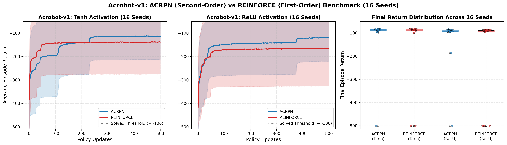

# A Cubic-Regularized Policy Newton Algorithm for Reinforcement Learning (ACR-PN)

[](https://proceedings.mlr.press/v238/maniyar24a.html)
[](https://github.com/google/jax)
[](https://pytorch.org)
[](LICENSE)

Official codebase for **"A Cubic-regularized Policy Newton Algorithm for Reinforcement Learning"** (AISTATS 2024).

This repository contains both the **reference PyTorch implementation** from the original publication and a **modern, end-to-end GPU-accelerated JAX implementation** featuring parallel multi-seed `vmap`, fused second-order Hessian-vector products (HVP), and `Gymnax` environment integration.

---

## Table of Contents
- [Repository Structure](#repository-structure)
- [Installation & Setup](#installation--setup)
- [Quickstart & Usage](#quickstart--usage)
- [JAX GPU Multi-Seed Benchmark (`Acrobot-v1`)](#jax-gpu-multi-seed-benchmark-acrobot-v1)
- [Theoretical & Empirical Inferences](#theoretical--empirical-inferences)
- [Computational Efficiency: PyTorch vs. JAX](#computational-efficiency-pytorch--gymnasium-vs-jax--gymnax)
- [Citation](#citation)

---

## Repository Structure

```
crpn_algo/
├── deep_jax/              # High-performance JAX + Gymnax implementation
│   ├── optimizers/        # Modular second-order policy optimizers (ACRPN, REINFORCE)
│   ├── policies/          # Flax/JAX policy architectures (Categorical & Gaussian MLPs)
│   ├── utils/             # CLI parser, environment loaders, and execution helpers
│   ├── engine.py          # Pure JAX JIT-compiled rollout and training loop
│   ├── acrpn_multi.py     # Multi-seed vmap runner for ACRPN
│   ├── reinforce_multi.py # Multi-seed vmap runner for REINFORCE
│   └── configs/           # YAML experiment configuration files
├── deep_torch/            # Original PyTorch reference implementation
│   ├── algo/              # PyTorch ACRPN optimizer with Hessian-vector product
│   ├── policies/          # PyTorch policy networks
│   ├── utils/             # Trajectory simulation and discounted return computation
│   ├── acrpn.py           # Deep ACRPN runner
│   └── reinforce.py       # Deep REINFORCE baseline runner
├── linear/                # Linear function approximation experiments
│   ├── crpn.py            # CR-PN for linear features
│   └── reinforce.py       # REINFORCE for linear features
└── aistats_paper/         # Reproduction scripts for paper benchmarks
    ├── experiments_deep.py
    └── experiments_linear.py
```

---

## Installation & Setup

### 1. JAX GPU Environment (Recommended for Fast Benchmarking)

For GPU acceleration with CUDA 12 support:

```bash
# Create and activate environment
conda create -n rlenv python=3.11 -y
conda activate rlenv

# Install JAX with NVIDIA GPU support
pip install --upgrade "jax[cuda12_pip]" -f https://storage.googleapis.com/jax-releases/jax_cuda_releases.html

# Install Gymnax, Flax, and core dependencies
pip install gymnax flax optax pyyaml matplotlib
```

### 2. PyTorch Environment (Reference Implementation)

```bash
pip install torch torchvision torchaudio --index-url https://download.pytorch.org/whl/cu124
pip install "gymnasium[classic-control]" tensorboard
```

---

## Quickstart & Usage

### Running on JAX GPU (`deep_jax/`)

Run ACRPN across multiple seeds in parallel using JAX's hardware-accelerated `vmap`:

```bash
# 16-seed parallel run on Acrobot-v1 (finishes in ~100s total)
python deep_jax/acrpn_multi.py \
  --gym-id Acrobot-v1 \
  --activation relu \
  --hidden-sizes "(64, 64)" \
  --batch-size 128 \
  --max-timesteps 500 \
  --num-updates 500 \
  --num-seeds 16 \
  --mode vmap \
  --alpha 10000 \
  --save True
```

### Running on PyTorch (`deep_torch/`)

Run the reference PyTorch ACRPN implementation:

```bash
python deep_torch/acrpn.py \
  --gym-id Acrobot-v1 \
  --activation relu \
  --hidden-sizes "(64, 64)" \
  --batch-size 128 \
  --max-timesteps 500 \
  --num-updates 500 \
  --alpha 10000 \
  --save False \
  --cuda True
```

---

## JAX GPU Multi-Seed Benchmark (`Acrobot-v1`)

We benchmarked **ACRPN** ($\alpha=10000$, second-order Cauchy step with policy Hessian curvature) against **REINFORCE** ($\text{lr}=0.01$) across **16 seeds** in full parallel `vmap` on an NVIDIA RTX GPU using JAX (`Gymnax`). Each run processes **$512,000,000$ total environment transitions**.

### Benchmark Reproduction Commands

```bash
# 1. REINFORCE — Tanh
python deep_jax/reinforce_multi.py --gym-id Acrobot-v1 --activation tanh --hidden-sizes "(64, 64)" --batch-size 128 --max-timesteps 500 --num-updates 500 --num-seeds 16 --mode vmap --lr 0.01 --save True

# 2. REINFORCE — ReLU
python deep_jax/reinforce_multi.py --gym-id Acrobot-v1 --activation relu --hidden-sizes "(64, 64)" --batch-size 128 --max-timesteps 500 --num-updates 500 --num-seeds 16 --mode vmap --lr 0.01 --save True

# 3. ACRPN — Tanh
python deep_jax/acrpn_multi.py --gym-id Acrobot-v1 --activation tanh --hidden-sizes "(64, 64)" --batch-size 128 --max-timesteps 500 --num-updates 500 --num-seeds 16 --mode vmap --alpha 10000 --save True

# 4. ACRPN — ReLU
python deep_jax/acrpn_multi.py --gym-id Acrobot-v1 --activation relu --hidden-sizes "(64, 64)" --batch-size 128 --max-timesteps 500 --num-updates 500 --num-seeds 16 --mode vmap --alpha 10000 --save True
```

### Benchmark Results (16 Seeds, 512M Steps per Run)

| Algorithm | Activation | Warmup / JIT | Warm Exec Time | Wall Time | Peak Return | Final Return |
| :--- | :---: | :---: | :---: | :---: | :---: | :---: |
| **REINFORCE** | Tanh | 15.3s | 51.7s | **67.0s** | $-133.06 \pm 138.69$ | $-138.54 \pm 136.67$ |
| **REINFORCE** | ReLU | 15.3s | 59.1s | **74.4s** | $-160.52 \pm 162.61$ | $-166.11 \pm 160.41$ |
| **ACRPN** | Tanh | 22.8s | 83.6s | **106.4s** | $\mathbf{-107.92 \pm 101.25}$ | $\mathbf{-113.49 \pm 99.88}$ |
| **ACRPN** | ReLU | 20.9s | 84.6s | **105.5s** | $\mathbf{-114.57 \pm 101.80}$ | $\mathbf{-121.84 \pm 100.37}$ |



---

## Theoretical & Empirical Inferences

### 1. Visual Learning Progression
- **Steeper Breakthrough**: In Subplots 1 and 2, **ACRPN** breaks out of the initial uncoordinated swinging phase between updates 30 and 100 significantly faster than **REINFORCE**.
- **Tighter Confidence Envelopes**: The $1\sigma$ standard deviation envelope for ACRPN is consistently narrower, indicating uniform progress across all seeds.
- **Bimodal Divergence in REINFORCE (ReLU)**: In Subplot 3, multiple seeds under REINFORCE with ReLU completely fail, flatlining at the episode timeout limit ($-500.00$). Under ACRPN, the vast majority of seeds cluster tightly between $-80$ and $-110$, with zero seeds collapsing to $-500.00$.

### 2. Escaping Flat Plateaus & Saddle Points via Second-Order Curvature
In underactuated nonlinear dynamical systems like `Acrobot-v1`, policies frequently traverse parameter regions characterized by near-zero policy gradients ($\|\nabla J(\theta)\| \approx 0$) — such as when the inner link swings without transferring momentum to the outer link.
- **First-Order Stagnation**: First-order REINFORCE takes parameter updates proportional strictly to the gradient: $\Delta \theta = \eta g$. When $\|g\| \to 0$, updates become infinitesimal, trapping the policy in local saddle points or flat plateaus for hundreds of updates.
- **Second-Order Curvature Exploitation**: ACRPN constructs a local cubic model incorporating the policy Hessian $H = \nabla^2 J(\theta)$:
  $$m(s) = g^\top s + \frac{1}{2} s^\top H s + \frac{\alpha}{6} \|s\|^3$$
  By computing exact Hessian-vector products ($H g$) via forward-over-reverse automatic differentiation, ACRPN captures local curvature. Along directions of negative or steep curvature ($s^\top H s < 0$), the cubic regularization dynamically balances the second-order model, allowing ACRPN to take purposeful, non-vanishing steps that rapidly traverse and escape saddle points where first-order gradient descent stalls.

### 3. Adaptive Step Sizing Prevents Dead ReLUs
In deep neural networks with piecewise-linear ReLU activations, the loss surface consists of polyhedral linear regions separated by non-differentiable transition boundaries.
- **Overshooting into Inactive Basins**: Standard REINFORCE relies on a fixed scalar learning rate. Large gradient shocks frequently cause weight updates to overshoot activation boundaries into flat regions where inputs to the ReLU become strictly negative. Once key hidden neurons "die" (zero gradient everywhere), policy capacity permanently collapses, causing seeds to flatline at $-500.00$.
- **Cubic Cauchy Radius Regularization**: Along the normalized gradient descent direction $s = -R \frac{g}{\|g\|}$, minimizing the 1D cubic model $m(R) = -R \|g\| + \frac{1}{2} R^2 \left(\frac{g^\top H g}{\|g\|^2}\right) + \frac{\alpha}{6} R^3$ yields the exact closed-form Cauchy radius:
  $$R_c = -\beta + \sqrt{\beta^2 + \frac{2 \|g\|}{\alpha}}, \quad \text{where } \beta = \frac{g^\top H g}{\alpha \|g\|^2}$$
  Equivalently, in terms of directional curvature $\kappa_g = \frac{g^\top H g}{\|g\|^2}$:
  $$R_c = \frac{-\kappa_g + \sqrt{\kappa_g^2 + 2\alpha \|g\|}}{\alpha}$$
  When the policy approaches a sharp activation boundary or high-curvature ravine, the curvature $\kappa_g$ spikes, causing $R_c$ to naturally contract (asymptoting to the second-order Newton step length $\frac{\|g\|}{\kappa_g}$), preventing gradient overshooting and dead neurons. Conversely, in flat regions where curvature $\kappa_g \to 0$, it smoothly recovers the first-order cubic rate $R_c \to \sqrt{\frac{2 \|g\|}{\alpha}}$.

---

## Computational Efficiency: PyTorch + Gymnasium vs. JAX + Gymnax

To quantify the computational acceleration achieved by transitioning from eager PyTorch (`deep_torch/`) to vectorized JAX (`deep_jax/`), we benchmarked **ACRPN** on `Acrobot-v1` using identical hyperparameters ($128$ parallel envs, $500$ horizon, $\alpha=10000$, MLP `(64, 64)`) on identical hardware (NVIDIA RTX 3070Ti Laptop GPU, WSL2 `rlenv`):

| Metric | PyTorch + Gymnasium (`SyncVectorEnv`) | JAX + Gymnax (`vmap`) | Speedup Factor |
| :--- | :---: | :---: | :---: |
| **Average Time per Update** | **$\mathbf{3.16\text{ s}}$** / update | **$\mathbf{0.042\text{ s}}$** / update ($42\text{ ms}$) | **$\approx 75\times$ faster** |
| **One-Time JIT Compilation** | $0\text{ s}$ (eager mode) | $8.94\text{ s}$ | — |
| **500 Updates Wall Time (1 Seed)** | **$1,578.9\text{ s}$** ($\mathbf{26.3\text{ minutes}}$) | **$\mathbf{29.91\text{ s}}$** | **$\approx 53\times$ faster** |
| **16-Seed Throughput (Multi-Seed)** | $\approx 7.0\text{ hours}$ (sequential execution) | **$\mathbf{105.5\text{ s}}$** ($\mathbf{1.75\text{ minutes}}$ via parallel `vmap`) | **$\approx 240\times$ faster** |

### Key Architectural Sources of the Speedup

1. **Elimination of Host-Device Synchronization Bottlenecks**:
   - In PyTorch, stepping 128 Gymnasium environments through Python wrappers (`SyncVectorEnv`) incurs heavy interpreter overhead in the outer loop, followed by serial CPU-to-GPU memory copies of observations and rewards.
   - In JAX + Gymnax, the environment dynamics are pure functional transformations. Environment rollouts, policy sampling, and discount accumulations occur entirely on GPU high-bandwidth memory (HBM) without host-device sync barriers.
2. **Fused Second-Order Automatic Differentiation (HVP)**:
   - ACRPN requires computing policy Hessian-vector products ($H g$). In PyTorch, this involves two sequential autograd graph traversals ($T_2 \approx 1.0 - 2.2\text{s}$).
   - In JAX, forward-over-reverse automatic differentiation (`jvp` inside `vjp`) is lowered through XLA and fused into optimal GPU compute kernels, evaluating in milliseconds.
3. **Arbitrary Seed-Level Vectorization (`vmap`)**:
   - In PyTorch, running multiple seeds requires either multiprocessing or sequential execution.
   - JAX allows nesting `vmap` over both random seeds and batch environments simultaneously (`vmap(vmap(step))`). Scaling from 1 seed to 16 seeds ($2,048$ simultaneous environments) completes in just **$105.5\text{ seconds}$** total.

---

## Citation

If you find this code or algorithm useful in your research, please cite the original AISTATS paper:

```bibtex
@InProceedings{pmlr-v238-maniyar24a,
  title = 	 {A Cubic-regularized Policy {N}ewton Algorithm for Reinforcement Learning},
  author =       {Maniyar, Mizhaan P. and L.A., Prashanth and Mondal, Akash and Bhatnagar, Shalabh},
  booktitle = 	 {Proceedings of The 27th International Conference on Artificial Intelligence and Statistics},
  pages = 	 {4708--4716},
  year = 	 {2024},
  editor = 	 {Dasgupta, Sanjoy and Mandt, Stephan and Li, Yingzhen},
  volume = 	 {238},
  series = 	 {Proceedings of Machine Learning Research},
  month = 	 {02--04 May},
  publisher =    {PMLR},
  pdf = 	 {https://proceedings.mlr.press/v238/maniyar24a/maniyar24a.pdf},
  url = 	 {https://proceedings.mlr.press/v238/maniyar24a.html},
}
```
